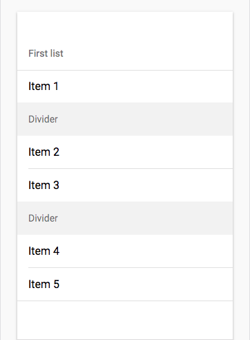

# \<morph-list-view-divider\>

[](https://opensource.org/licenses/Apache-2.0) [](https://www.webcomponents.org/element/PolymerElements/paper-progress)

Divider component for list view

`morph-list-view-divider` changes its look based on when it is either IOS device or Android device.

## Getting Started

For the information about how to clone the desired repository, running the local server and testing, please refer to Polymorph elements getting started docs at the end of this repository.

## Demo

- For an inline demo you can edit please see `morph-list-view` component on webcomponents website here [morph-list-view]

- Here is a quick demo of the `morph-list-view-divider` element for **IOS platform**.

  <p align="center">
    
  </p>

- Here is a quick demo of the `morph-list-view-divider` element for **Android platform**.

  <p align="center">
    
  </p>

- Here is the `morph-list-view-divider` HTML markup for both **IOS** and **Android** platform

```html

<template>
  <morph-list-view>
    <morph-list-view-title>Title</morph-list-view-title>
    <morph-list-view-item>Item 1</morph-list-view-item>

    <morph-list-view-divider>Divider</morph-list-view-divider>

    <morph-list-view-item>Item 2</morph-list-view-item>
    <morph-list-view-item>Item 3</morph-list-view-item>

    <morph-list-view-divider>Divider</morph-list-view-divider>

    <morph-list-view-item>Item 4</morph-list-view-item>
    <morph-list-view-item>Item 5</morph-list-view-item>
  </morph-list-view>
</template>

```

## Further help

For more information on how to install and run test please go here - [Polymorph elements getting started]

[Polymorph elements getting started]: https://github.com/moduware/polymorph-components/blob/master/INFO.md

[morph-list-view]: https://www.webcomponents.org/element/moduware/morph-list-view
